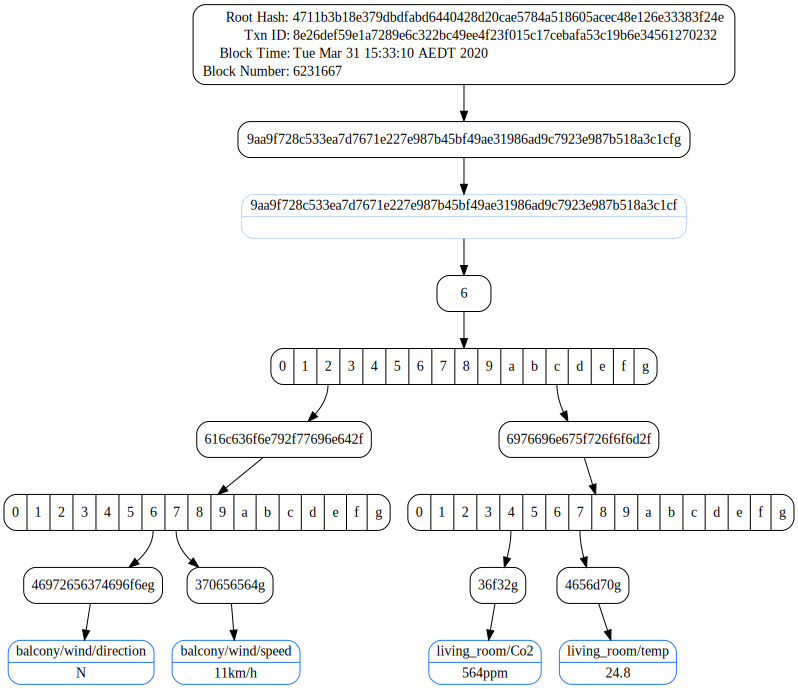
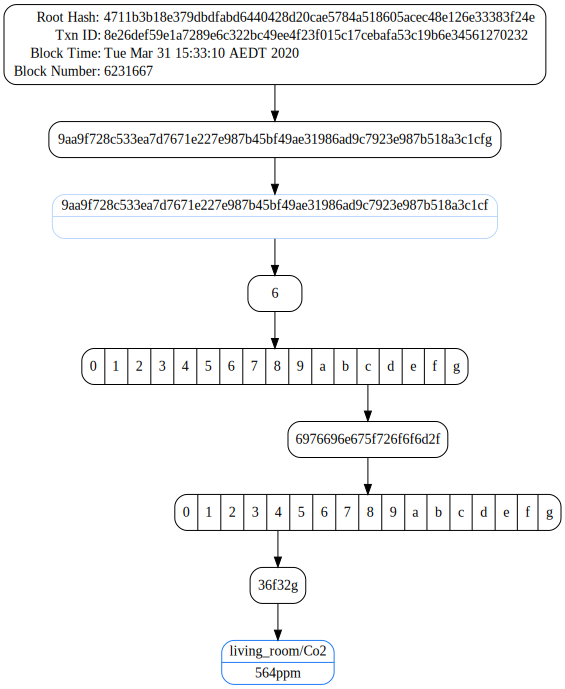

# [Proofable](https://github.com/SouthbankSoftware/proofable)

[](https://pkg.go.dev/github.com/SouthbankSoftware/proofable/pkg/api?tab=doc)
[](https://goreportcard.com/report/github.com/SouthbankSoftware/proofable)

Proofable is a framework for proving any digital asset to Blockchains. Overall, it consists:

- [**CLI** (`proofable-cli`)](https://github.com/SouthbankSoftware/proofable/tree/master/cmd/proofable-cli): the command-line interface (CLI) for API Service (`proofable-api`). At the moment, it supports proving a file-system to Ethereum

  - [Documentation](cmd/proofable-cli/README.md)

- **API Service** (`proofable-api`): the general purpose proving service that is fast and effective. It provides a set of APIs to manipulate trie structures and generate blockchain proofs for any digital asset. A trie is a dictionary of ordered key-values that can be built incrementally, whose root hash at any given time can be dervied efficiently. Once the root hash is proven to a Blockchain, every key-value is proven, so as the digital asset stored in that key-value

  - [gRPC Protocol Documentation](https://www.proofable.io/docs/api.html)
  - [gRPC Protocol Definition](https://github.com/SouthbankSoftware/proofable/blob/master/pkg/protos/api/api.proto)

- **Anchor Service** (`provendb-anchor`): the service continuously anchors hashes to Blockchains, which is similar to what Chainpoint does, but with much better performance and flexibility. It supports multiple anchor types and proof formats. Digital signing can be also done at the Merkle root level. It is consumed by `proofable-api`, and is not directly public-accessible at the moment

  - [gRPC Protocol Documentation](https://www.proofable.io/docs/anchor.html)
  - [gRPC Protocol Definition](https://github.com/SouthbankSoftware/proofable/blob/master/pkg/protos/anchor/anchor.proto)

## Node SDK

The Node SDK with sample examples is available [here](https://github.com/SouthbankSoftware/proofable/tree/master/node_sdk)

## Example using Go SDK

This is a hello world example written in Go that demonstrates how to:

- authenticate with ProvenDB

- prove a bunch of key-values to Ethereum Testnet within a minute

- create a proof for them

- verify the proof

- extract a subproof for just one key-value out of the proof

- verify the subproof independently

The packages in [`pkg`](https://pkg.go.dev/github.com/SouthbankSoftware/proofable/pkg) altogether resembles a Go SDK for Proofable, which provides great convenience when consuming `proofable-api`

You can find the complete example source code [here](https://github.com/SouthbankSoftware/proofable/tree/master/docs/example.go), which can be run as:

```go
go run docs/example.go
```

### Step 1: authenticate with ProvenDB

This step will authenticate with ProvenDB so you can access `proofable-api`. When you are successfully authenticated, an access token will be saved to a global location on your machine. On Mac, it is at `~/Library/Application\ Support/ProvenDB/auth.json`. The next time, when you invoke `AuthenticateForGRPC`, it will automatically use the saved token without prompting you to go through the authentication steps again

```go
creds, err := authcli.AuthenticateForGRPC(ctx,
    "https://apigateway.dev.provendb.com",
    true,
    "",
)
```

### Step 2: create a gRPC client

This step creates a gRPC client (`cli`) to be used in a closure. When the closure exits, the client will be automatically destroyed. You could also create a client without a closure using [`NewAPIClient`](https://pkg.go.dev/github.com/SouthbankSoftware/proofable/pkg/api?tab=doc#NewAPIClient), but in that case, you have to manually destroy the client after use

```go
api.WithAPIClient(
    "api.dev.provendb.com:443",
    creds,
    func(cli apiPB.APIServiceClient) error {
        // make use of the `cli` in this closure
    })
```

### Step 3: create an empty trie

This step creates an empty trie, which is a dictionary that can hold key-values, to be used in a closure. When the closure exits, the trie will be automatically destroyed. You could also create an empty trie without a closure using [`CreateTrie`](https://pkg.go.dev/github.com/SouthbankSoftware/proofable/pkg/api?tab=doc#CreateTrie), but in that case, you have to manually destroy the trie using [`DeleteTrie`](https://pkg.go.dev/github.com/SouthbankSoftware/proofable/pkg/api?tab=doc#DeleteTrie) or wait for `proofable-api` to garbage collect it

```go
api.WithTrie(ctx, cli, func(id, root string) error {
    // make use of the trie, identified by the `id`, in this closure. The root will always be 0000000000000000000000000000000000000000000000000000000000000000 for an empty trie
})
```

### Step 4: set the key-values we want to prove

This step sets a bunch of key-values that we want to prove in the trie we have just created. In the example, they are my home sensor readings. Both key and value can be arbitrary binaries. They key order doesn't matter. When getting key-values from the trie, e.g. [`GetTrieKeyValues`](https://pkg.go.dev/github.com/SouthbankSoftware/proofable/pkg/api?tab=doc#GetTrieKeyValues), they will always be sorted according to the key's alphabetical order. When setting key-values, you can also make multiple [`SetTrieKeyValues`](https://pkg.go.dev/github.com/SouthbankSoftware/proofable/pkg/api?tab=doc#SetTrieKeyValues) calls as a way to build up a large trie incrementally

```go
root, err := api.SetTrieKeyValues(ctx, cli, id, root,
    []*apiPB.KeyValue{
        {Key: []byte("balcony/wind/speed"), Value: []byte("11km/h")},
        {Key: []byte("balcony/wind/direction"), Value: []byte("N")},
        {Key: []byte("living_room/temp"), Value: []byte("24.8℃")},
        {Key: []byte("living_room/Co2"), Value: []byte("564ppm")},
    })
```

### Step 5: create a proof for the key-values

This step creates a proof, a.k.a. trie proof, to prove the trie at the given root to Ethereum ([`ETH`](https://www.proofable.io/docs/anchor.html#anchor.Anchor.Type)). The trie at the given root contains all the key-values we want to prove. When the trie is proven, so are the key-values contained in

```go
triePf, err := api.CreateTrieProof(ctx, cli, id, root, anchorPB.Anchor_ETH)
```

### Step 6: wait for the proof to be anchored to Ethereum

This step waits the proof we have just created until it is anchored to Ethereum, during which we output the anchoring progress

```go
tpCH, errCH := api.SubscribeTrieProof(ctx, cli, id, triePf.GetId())

for tp := range tpCH {
    log.Printf("Anchoring proof: %s\n", tp.GetStatus())
    triePf = tp
}

// always check error from the error channel
err = <-errCH
```

### Step 7: verify the proof

This step verifies the proof we have just created. The verification is supposed to be run at any time after the proof has been created and when we want to make sure our proof is valid as well as retrieving information out from the proof

```go
kvCH, rpCH, errCH := api.VerifyTrieProof(ctx, cli, id, triePf.GetId(),
    true, "proof.dot")

// strip the anchor trie part from each key
kvCH = api.InterceptKeyValueStream(ctx, kvCH,
    api.StripCompoundKeyAnchorTriePart)

log.Println("key-values contained in the proof:")
for kv := range kvCH {
    log.Printf("\t%s -> %s\n",
        strutil.String(kv.Key), strutil.String(kv.Value))
}

// always check error from the error channel
err = <-errCH
if err != nil {
    return err
}

rp := <-rpCH
if !rp.GetVerified() {
    return fmt.Errorf("falsified proof: %s", rp.GetError())
}

log.Printf("the proof with a root hash of %s is anchored to %s in block %v with transaction %s at %s, which can be viewed at %s\n",
    triePf.GetProofRoot(),
    triePf.GetAnchorType(),
    triePf.GetBlockNumber(),
    triePf.GetTxnId(),
    time.Unix(int64(triePf.GetBlockTime()), 0).Format(time.UnixDate),
    triePf.GetTxnUri(),
)
```

This step will output the key-values contained in the proof:

```zsh
balcony/wind/direction -> N
balcony/wind/speed -> 11km/h
living_room/Co2 -> 564ppm
living_room/temp -> 24.8℃
```

and a summary:

```zsh
the proof with a root hash of 4711b3b18e379dbdfabd6440428d20cae5784a518605acec48e126e33383f24e is anchored to ETH in block 6231667 with transaction 8e26def59e1a7289e6c322bc49ee4f23f015c17cebafa53c19b6e34561270232 at Tue Mar 31 15:33:10 AEDT 2020, which can be viewed at https://rinkeby.etherscan.io/tx/0x8e26def59e1a7289e6c322bc49ee4f23f015c17cebafa53c19b6e34561270232
```

and a Graphviz Dot Graph (`proof.dot`):



### Step 8: extract a subproof for just one key-value out of the proof

This step extracts a subproof, a.k.a. key-values proof, out of the proof we have just created. The subproof proves the key `living_room/Co2` only and nothing else. A subproof file named `living_room_Co2.pxsubproof` will be created in current working directory. You could also create a subproof for multiple key-values

```go
api.CreateKeyValuesProof(ctx, cli, id, triePf.GetId(),
    &apiPB.KeyValuesFilter{
        Keys: []*apiPB.Key{
            {Key: []byte("living_room/Co2")},
        },
    },
    "living_room_Co2.pxsubproof")
```

### Step 9: verify the subproof independently

This step independently verifies the subproof we have just created. The only thing needed in order to verify the subproof is the subproof file itself. The verification is supposed to be run at any time after the subproof has been created and when we want to make sure our subproof is valid as well as retrieving information out from the subproof

```go
kvCH, rpCH, errCH := api.VerifyKeyValuesProof(ctx, cli,
    "living_room_Co2.pxsubproof",
    true, "living_room_Co2_subproof.dot")

// strip the anchor trie part from each key
kvCH = api.InterceptKeyValueStream(ctx, kvCH,
    api.StripCompoundKeyAnchorTriePart)

log.Println("key-values contained in the subproof:")
for kv := range kvCH {
    log.Printf("\t%s -> %s\n",
        strutil.String(kv.Key), strutil.String(kv.Value))
}

// always check error from the error channel
err = <-errCH
if err != nil {
    return err
}

rp := <-rpCH
if !rp.GetVerified() {
    return fmt.Errorf("falsified subproof: %s", rp.GetError())
}

et, err := api.GetEthTrieFromKeyValuesProof("living_room_Co2.pxsubproof")
if err != nil {
    return err
}
merkleRoot := hex.EncodeToString(et.Root())

log.Printf("the subproof with a root hash of %s is anchored to %s in block %v with transaction %s at %s, which can be viewed at %s\n",
    merkleRoot,
    et.AnchorType,
    et.BlockNumber,
    et.TxnID,
    time.Unix(int64(et.BlockTime), 0).Format(time.UnixDate),
    et.TxnURI,
)
```

This step will output the key-values contained in the subproof:

```zsh
living_room/Co2 -> 564ppm
```

and a summary:

```zsh
the subproof with a root hash of 4711b3b18e379dbdfabd6440428d20cae5784a518605acec48e126e33383f24e is anchored to ETH in block 6231667 with transaction 8e26def59e1a7289e6c322bc49ee4f23f015c17cebafa53c19b6e34561270232 at Tue Mar 31 15:33:10 AEDT 2020, which can be viewed at https://rinkeby.etherscan.io/tx/0x8e26def59e1a7289e6c322bc49ee4f23f015c17cebafa53c19b6e34561270232
```

and a Graphviz Dot Graph (`living_room_Co2_subproof.dot`):


