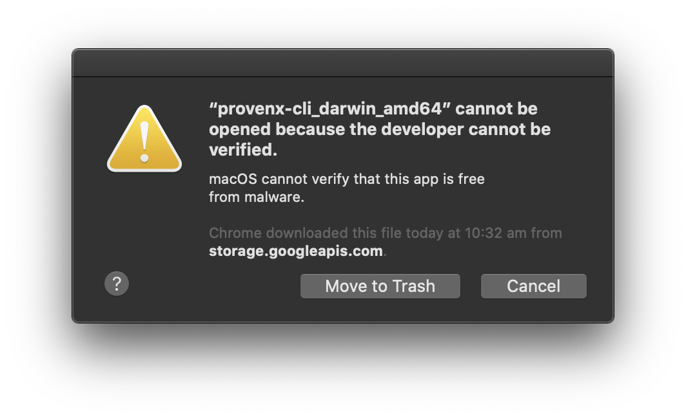

# provenx-cli

`provenx-cli` is a simple CLI for ProvenX API Service (`provenx-api`)

## Usage

_**Currently**_, `provenx-cli` connects directly to the dev `provenx-api` with TLS, which can be configured via CLI options, and magic auth token. File metadata is not included in trie generation.

### Download dev binaries

- [mac](https://storage.googleapis.com/provendb-dev/provenx-cli/provenx-cli_darwin_amd64)
- [linux](https://storage.googleapis.com/provendb-dev/provenx-cli/provenx-cli_linux_amd64)
- [windows](https://storage.googleapis.com/provendb-dev/provenx-cli/provenx-cli_windows_amd64.exe)

If you got the following cannot open issue on macOS Catalina:



use the following command to fix:

```bash
xattr -d com.apple.quarantine path/to/provenx-cli_darwin_amd64
```

### Build your own binary

```bash
# generate the `provenx-cli` binary
make
```

### Examples

```bash
# for help
./provenx-cli -h

# create a trie for a path
./provenx-cli create trie path/to/the/data

# create a trie for a path in a custom trie location
./provenx-cli create trie path/to/the/data -o path/to/output/the/trie.pxt

# verify a trie for a path
./provenx-cli verify trie path/to/the/data

# verify a trie for a path and output the trie's Graphviz Dot Graph
./provenx-cli verify trie path/to/the/data -d path/to/output/the/dot/graph.dot

# verify a trie for a path from a custom trie location
./provenx-cli verify trie path/to/the/data -i path/to/the/trie.pxt
```
