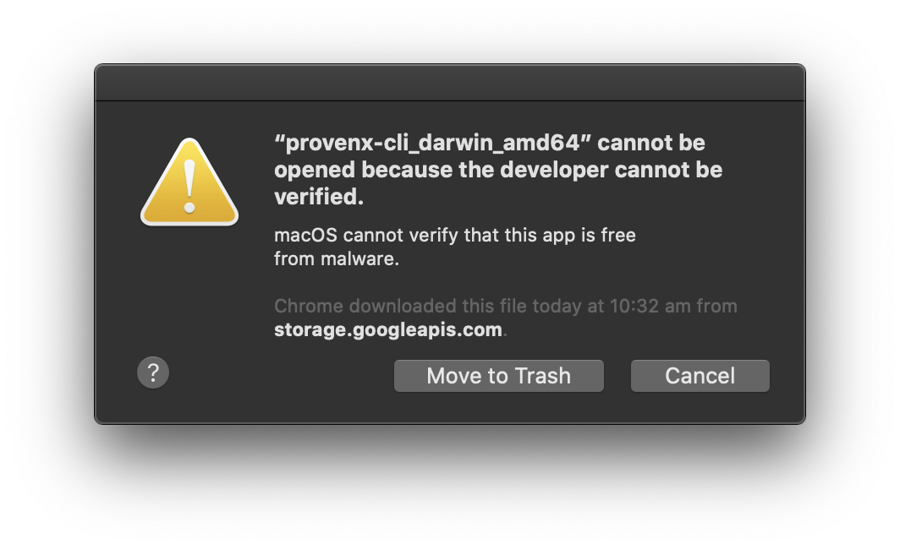

# [proofable-cli](https://github.com/SouthbankSoftware/proofable/tree/master/cmd/proofable-cli)

`proofable-cli` is the command-line interface (CLI) for [Proofable](https://docs.proofable.io/) API Service (`proofable-api`). At the moment, it supports proving a file-system to Ethereum

## Usage

### Download dev binaries

- [mac](https://storage.googleapis.com/provendb-dev/proofable-cli/proofable-cli_darwin_amd64)
- [linux](https://storage.googleapis.com/provendb-dev/proofable-cli/proofable-cli_linux_amd64)
- [windows](https://storage.googleapis.com/provendb-dev/proofable-cli/proofable-cli_windows_amd64.exe)

### Build your own binary

```bash
# generate the `proofable-cli` binary
make
```

### Examples

```bash
# for help
./proofable-cli -h

# authenticate with ProvenDB. You don't have to explicitly run this. When you execute a command that requires authentication, it will be automatically run
./proofable-cli auth

# remove existing authentication
./proofable-cli auth -d

# create a proof for a path
./proofable-cli create proof path/to/the/data

# create a proof for a path in a custom location
./proofable-cli create proof path/to/the/data -p path/to/output/the/proof.pxproof

# create a proof for a path including metadata
./proofable-cli create proof path/to/the/data --include-metadata

# verify a proof for a path
./proofable-cli verify proof path/to/the/data

# verify a proof for a path and output the proof's Graphviz Dot Graph
./proofable-cli verify proof path/to/the/data -d path/to/output/the/dot/graph.dot

# verify a proof for a path from a custom location
./proofable-cli verify proof path/to/the/data -p path/to/the/proof.pxproof

# create a subproof out of a proof
./proofable-cli create subproof key1_of_the_proof key2_of_the_proof -p path/to/the/proof.pxproof -s path/to/output/the/subproof.pxsubproof

# verify a subproof for a path
./proofable-cli verify subproof path/to/the/data -s path/to/the/subproof.pxsubproof

# verify a subproof for a path and output the subproof's Graphviz Dot Graph
./proofable-cli verify subproof path/to/the/data -s path/to/the/subproof.pxsubproof -d path/to/output/the/dot/graph.dot
```

## FAQ

### Error: "proofable-cli_darwin_amd64" cannot be opened because the developer cannot be verified



Use the following command to fix:

```bash
xattr -d com.apple.quarantine path/to/proofable-cli_darwin_amd64
```
