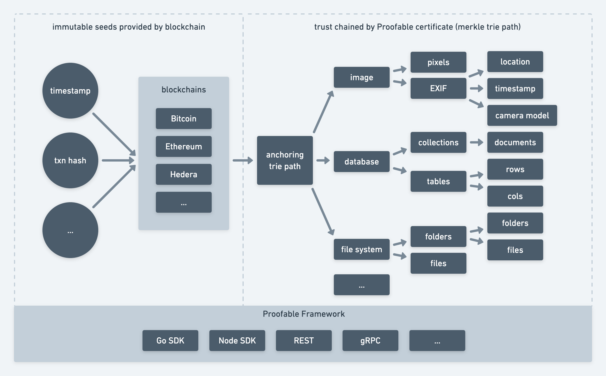

# Chain of Trust

When a piece of information (data) is anchored to a blockchain by Proofable using a Merkle trie, we can work backward using the corresponding Merkle trie path to assert that the data has existed from the time of the blockchain transaction. The Merkle trie path itself becomes a certificate for the data. We can generate such a certificate to prove that the data has existed from a timestamp. If the data is an image, then we can use the certificate to verify an arbitrary image and see whether someone has tampered with it. We can also use the timestamp to verify the certificate itself, such that when we trust the timestamp, we can check the validity of the certificate and then the image. In this way, the surface area for potential forgery attack is reduced to a block. Or if we remembered and trusted the transaction hash of the certificate, the attack surface is reduced to that transaction. The timestamp and transaction hash are the seed information like the [first principles](https://en.wikipedia.org/wiki/First_principle) in philosophy which we can base our trust on. In this way, a chain of trust is formed from the blockchain seeds to our image contents as in above figure. For more details, please check out our Medium post [Build Trust into Image with Blockchain](https://medium.com/@guiguan/build-trust-into-image-with-blockchain-4894c39bde7f)
