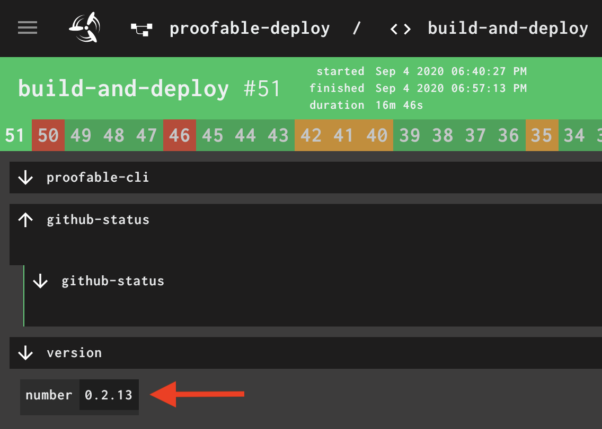

# Publish a new version

## Node SDK (NPM)

1. `npm login` (southbanksoftwareadmin)
2. `npm version patch` (or minor, major)
3. `npm publish`

## Go SDK & Proofable CLI

1. tag the commit using the version from [CI](https://concourse.provendb.com/teams/main/pipelines/proofable-deploy/jobs/build-and-deploy/builds/latest)

   

2. copy binaries from `dev` to `stg`

   ```zsh
   gsutil -m cp -ra public-read "gs://provendb-dev/proofable-cli/*" "gs://provendb-stg/proofable-cli"
   ```

3. copy binaries from `stg` to `prd`

   ```zsh
   gsutil -m cp -ra public-read "gs://provendb-stg/proofable-cli/*" "gs://provendb-prd/proofable-cli"
   ```

4. publish a new version to [Proofable Homebrew tap](https://github.com/SouthbankSoftware/homebrew-proofable):

   1. make sure the [tap](https://github.com/SouthbankSoftware/homebrew-proofable) is enabled. You can skip this step if it has already been done

      ```zsh
      brew tap southbanksoftware/proofable
      ```

   2. go to edit the checked out Formula file

      ```zsh
      cd $(brew --repo southbanksoftware/proofable)
      code Formula/proofable-cli.rb
      ```

   3. modify the `url` to point to the new version (the CI binary version in step 1) and remove the `sha256` field, then run the following to get the new sha256 hash

      ```zsh
      brew fetch proofable-cli --build-from-source
      ```

      Finally, re-add the `sha256` field in `proofable-cli.rb`

   4. create a PR for the change

      ```zsh
      # change v0.2.13 to the correct version
      git checkout -b release/v0.2.13
      git commit -am "Release v0.2.13"
      gh pr create --title "Release v0.2.13" --body "Normal release"
      ```

   5. wait for the PR test to pass and merge
   
   6. checkout out `master` and pull the latest for future development

      ```zsh
      git checkout master
      git pull
      ```
