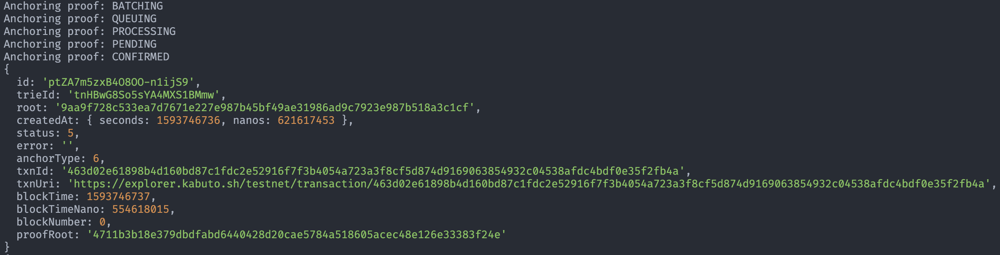
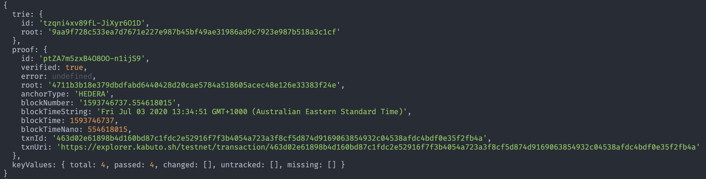
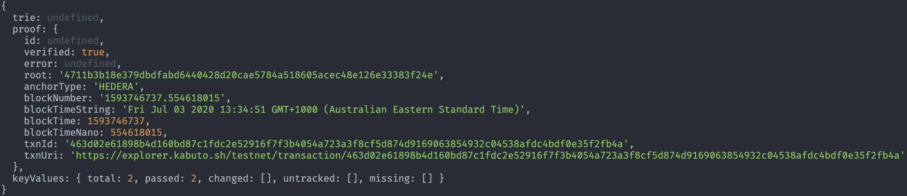
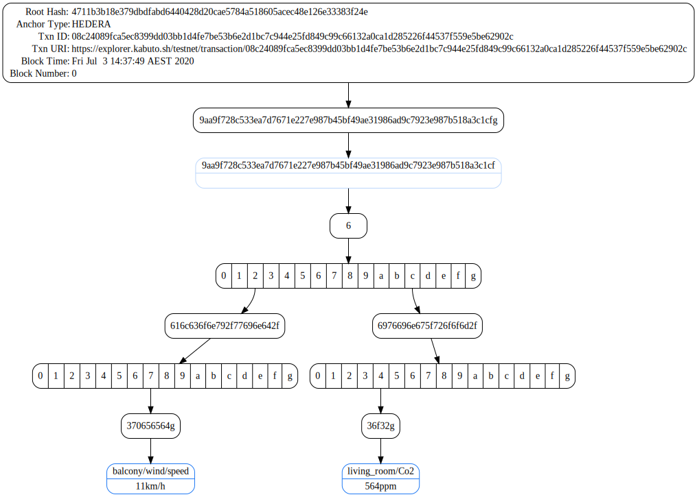

# Getting started

1. `npm i proofable`. We recommend the Node LTS versions: v12.16.3+

2. create an authentication token using: `./proofable-cli auth`. You can find details from [here](./typescript_example.html#step-1-authenticate-with-provendb)

3. import [Proofable package](https://www.npmjs.com/package/proofable)

   ```typescript
   import { newAPIClient, Anchor, Key /* and more */ } from "proofable";
   ```

4. create a Proofable API client

   ```typescript
   const client = newAPIClient("api.proofable.io:443");
   ```

5. create a [trie](../concepts/trie.html) from data. This creates a local trie (`Trie.StorageType.LOCAL`), which is temporarily persisted in each Proofable API service instance. You can also choose to create a cloud trie with `client.createTrieFromKeyValues(keyValues, Trie.StorageType.CLOUD)`, which will be persisted in Proofable cloud storage. The cloud trie has a much longer retention period and supports high-availability and large data volume. Also, you don't have to consistently export and import cloud tries for manipulations. Proofable talks directly to the cloud storage for you, which is ideal for incrementally building and storing large tries

   ```typescript
   const trie = await client.createTrieFromKeyValues(
     dataToKeyValues({
       "balcony/wind/speed": "11km/h",
       "balcony/wind/direction": "N",
       "living_room/temp": "24.8℃",
       "living_room/Co2": "564ppm",
     })
   );
   ```

6. anchor the trie to a blockchain that is [supported by Proofable](../concepts/anchor_types.html). Here we use [Hedera](https://www.hedera.com/) testnet, as it is cool and fast

   ```typescript
   const trieProof = await client.anchorTrie(trie, Anchor.Type.HEDERA);

   console.dir(trieProof.toObject());
   ```

   

7. export the trie for later use. This trie file is a self-contained certificate that can be used later on to do all sorts of manipulations, including verifiying the data

   ```typescript
   await client.exportTrie(trieId, "./example.proofable");
   ```

8. import and verify the trie we just exported. Note that in order to use this convenient and efficient verification API, we have to ensure the original key-values are sorted. This sorting can be done efficiently in real world case, e.g. when querying a database

   ```typescript
   const result = await client.importAndVerifyTrieWithSortedKeyValues(
     "./example.proofable",
     sortKeyValues(
       dataToKeyValues({
         "balcony/wind/speed": "11km/h",
         "balcony/wind/direction": "N",
         "living_room/temp": "24.8℃",
         "living_room/Co2": "564ppm",
       })
     ),
     undefined,
     "./example.proofable.dot"
   );

   console.dir(result);
   ```

   

   

9. create a key-values proof for the data subset directly from the already proved trie. This proof file is a self-contained certificate that proves the data subset

   ```typescript
   await client.createKeyValuesProof(
     result.trie!.id,
     result.proof.id!,
     KeyValuesFilter.from([
       Key.from("balcony/wind/speed"),
       Key.from("living_room/Co2"),
     ]),
     /*
     or you can directly use `KeyValue`s:
     KeyValuesFilter.from(
       dataToKeyValues({
         "balcony/wind/speed": "11km/h",
         "living_room/Co2": "564ppm",
       })
     )
     */
     "./example.subproofable"
   );
   ```

10. verify the key-values proof we just created. Again, we need to sort the original data subset

    ```typescript
    const result = await client.verifyKeyValuesProofWithSortedKeyValues(
      "./example.subproofable",
      sortKeyValues(
        dataToKeyValues({
          "balcony/wind/speed": "11km/h",
          "living_room/Co2": "564ppm",
        })
      ),
      "./example.subproofable.dot"
    );

    console.dir(result);
    ```

    As you can see, the `trie` and `proof.id` are `undefined` comparing to previous output, which indicates that the key-values proof is independent of any tries

    

    

You can find the complete source code of this guide from [here](https://github.com/SouthbankSoftware/proofable/blob/master/node_sdk/src/examples/typescript_basic.ts), which can be run as:

```zsh
npm run example-basic
```
