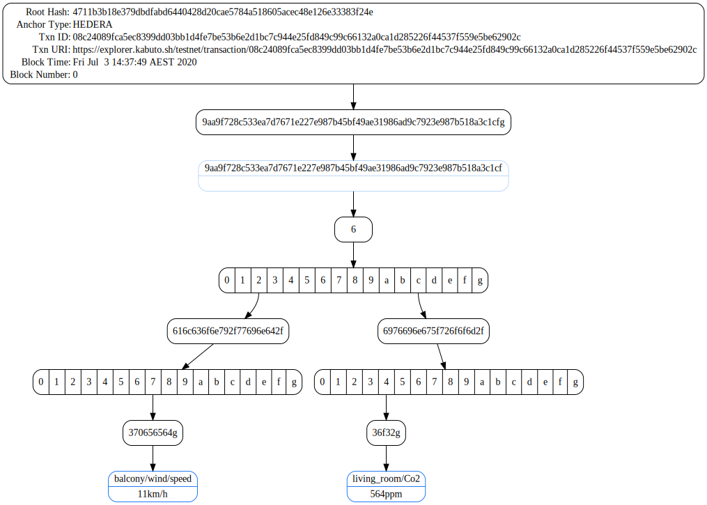

# [Proofable Node SDK](https://github.com/SouthbankSoftware/proofable/tree/master/node_sdk)

[](https://www.npmjs.com/package/proofable)

Proofable Node SDK provides a set of promise-based APIs as well as more advanced callback and stream based APIs. When dealing with the Proofable API Service, The promise-based APIs are convenient to be consumed in most use cases, while the callback and stream based APIs support more advanced features such as canceling and per-call gRPC options.

- [SDK Reference](https://www.proofable.io/node_sdk/docs/reference)
- [SDK GitHub Repo](https://github.com/SouthbankSoftware/proofable/tree/master/node_sdk)
- [SDK Examples](https://github.com/SouthbankSoftware/proofable/tree/master/node_sdk/src/examples)
- [Proofable Framework](https://www.proofable.io/)

## Getting Started

1. `npm i proofable`. We recommend the Node LTS versions: v12.16.3+

2. create an authentication token using: `./proofable-cli auth`. You can find details from [here](https://www.proofable.io/node_sdk/docs/example.html#step-1-authenticate-with-provendb)

3. ```typescript
   import { newAPIClient, Anchor, Key /* and more */ } from "proofable";
   ```

4. create a Proofable API client

   ```typescript
   const client = newAPIClient("api.dev.proofable.io:443");
   ```

5. create a [trie](https://www.proofable.io/docs/trie.html) from data

   ```typescript
   const trie = await client.createTrieFromKeyValues(
     dataToKeyValues({
       "balcony/wind/speed": "11km/h",
       "balcony/wind/direction": "N",
       "living_room/temp": "24.8℃",
       "living_room/Co2": "564ppm",
     })
   );
   ```

6. anchor the trie to a blockchain that is [supported by Proofable](https://www.proofable.io/docs/anchor.html#anchor.Anchor.Type). Here we use [Hedera](https://www.hedera.com/) testnet, as it is cool and fast

   ```typescript
   const trieProof = await client.anchorTrie(trie, Anchor.Type.HEDERA);

   console.dir(trieProof.toObject());
   ```

   

7. export the trie for later use. This trie file is a self-contained certificate that can be used later on to do all sorts of manipulations, including verifiying the data

   ```typescript
   await client.exportTrie(trieId, "./example.proofable");
   ```

8. import and verify the trie we just exported. Note that in order to use this convenient and efficient verification API, we have to ensure the original key-values are sorted. This sorting can be done efficiently in real world case, e.g. when querying a database

   ```typescript
   const result = await client.importAndVerifyTrieWithSortedKeyValues(
     "./example.proofable",
     sortKeyValues(
       dataToKeyValues({
         "balcony/wind/speed": "11km/h",
         "balcony/wind/direction": "N",
         "living_room/temp": "24.8℃",
         "living_room/Co2": "564ppm",
       })
     ),
     undefined,
     "./example.proofable.dot"
   );

   console.dir(result);
   ```

   

   

9. creates a key-values proof for the data subset directly from the already proved trie. This proof file is a self-contained certificate that proves the data subset

   ```typescript
   await client.createKeyValuesProof(
     result.trie!.id,
     result.proof.id!,
     KeyValuesFilter.from([
       Key.from("balcony/wind/speed"),
       Key.from("living_room/Co2"),
     ]),
     /*
     or you can directly use `KeyValue`s:
     KeyValuesFilter.from(
       dataToKeyValues({
         "balcony/wind/speed": "11km/h",
         "living_room/Co2": "564ppm",
       })
     )
     */
     "./example.subproofable"
   );
   ```

10. verify the key-values proof we just created. Again, we need to sort the original data subset

    ```typescript
    const result = await client.verifyKeyValuesProofWithSortedKeyValues(
      "./example.subproofable",
      sortKeyValues(
        dataToKeyValues({
          "balcony/wind/speed": "11km/h",
          "living_room/Co2": "564ppm",
        })
      ),
      "./example.subproofable.dot"
    );

    console.dir(result);
    ```

    As you can see, the `trie` and `proof.id` are `undefined` comparing to previous output, which indicates that the key-values proof is independent of any tries

    

    

### What's Next

- You can find the complete source code of this guide from [here](https://github.com/SouthbankSoftware/proofable/blob/master/node_sdk/src/examples/typescript_basic.ts). Or a more detailed example with both TypeScript and JavaScript from [here](https://www.proofable.io/node_sdk/docs/example.html)

- Getting yourself familiar with the [trie concept](https://www.proofable.io/docs/trie.html)

- Checking out the [Proofable Node SDK Reference](https://www.proofable.io/node_sdk/docs/reference)
